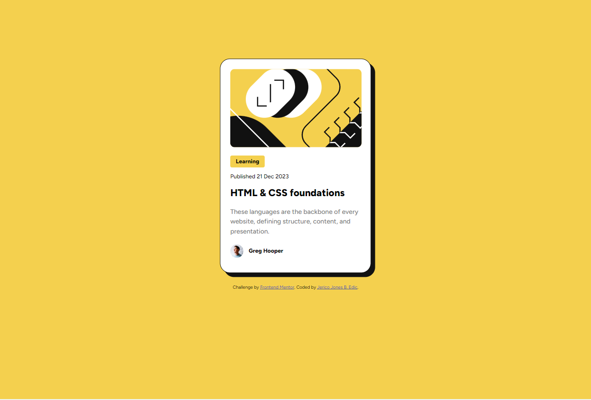
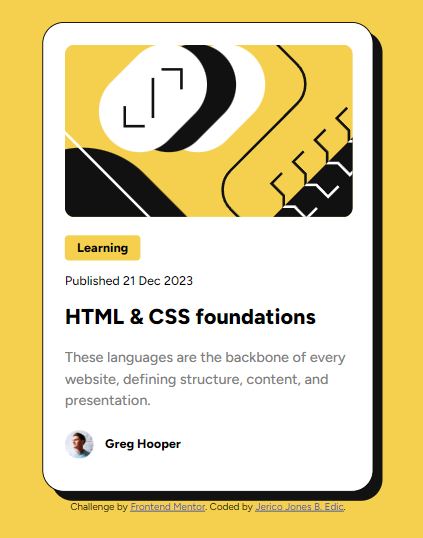

# Frontend Mentor - Blog preview card solution

This is a solution to the [Blog preview card challenge on Frontend Mentor](https://www.frontendmentor.io/challenges/blog-preview-card-ckPaj01IcS). Frontend Mentor challenges help you improve your coding skills by building realistic projects. 

## Table of contents

- [Overview](#overview)
  - [The challenge](#the-challenge)
  - [Screenshot](#screenshot)
  - [Links](#links)
- [My process](#my-process)
  - [Built with](#built-with)
  - [What I learned](#what-i-learned)
  - [Continued development](#continued-development)
  - [Useful resources](#useful-resources)
- [Author](#author)
- [Acknowledgments](#acknowledgments)

## Overview

### The challenge

Users should be able to:

- See hover and focus states for all interactive elements on the page

### Screenshot

 - Desktop View
 - Mobile View

### Links

- Solution URL: [Blog Preview Card Repository](https://github.com/0653Jerico/Blog-Preview_Card-Solution)
- Live Site URL: [Blog Preview Card Solution](https://0653jerico.github.io/Blog-Preview_Card-Solution/)

## My process

### Built with

- Semantic HTML5 markup
- CSS custom properties
- Flexbox

### What I learned

I learned how to use the basics of flexblox property and was able to understand the use of min-width and max-width of media query. I also had a glimpse of the use of float and I will be using it for future challenges.

### Continued development

Somehow, I feel like I was able to code the challenge easily this time since my first challenge. I was able to explore and understand other css properties that was able to help me complete this challenge.

### Useful resources

- [Google Fonts](https://www.fonts.google.com) - Still using this website to get my fonts, it is easy and contains a lot of fonts.
- [W3schools](https://www.w3schools.com) - I still rely on this website since it provides simplified explanations with examples.

## Author

- Frontend Mentor - [@0653Jerico](https://www.frontendmentor.io/profile/0653Jerico)

## Acknowledgments

First of all, I want to thank God for giving me the strength to learn everyday. I am also thankful to the website w3schools for providing such a detailed learning resources. I am also thankful to Frontend Mentor for providing this challenges and learning resources that helps newbies on their path to the IT industry.
